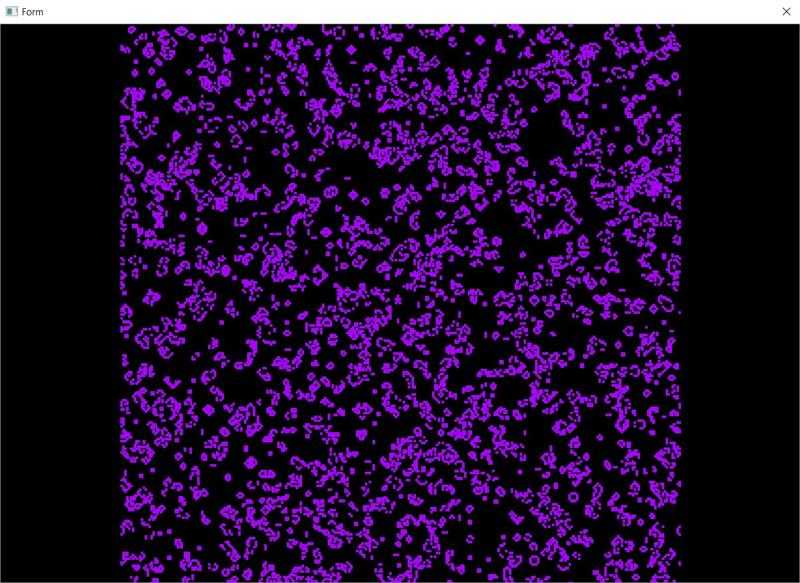

# Qt Game of Life

Учебный проект на языке программирования C++, реализующий клеточный автомат (игра "Жизнь"). На уровне кода представлен частью графического интерфейса (включая поле игры), написанной с использованием qt, и частью описывающей логику игры, написанной независимо от библиотеки.



## Сборка

### Предварительные требования
- Qt 6.4.1 или выше (разрабатывалось на Qt 6.4.1 в ОС Windows 10)
- CMake 3.5 или выше
- Компилятор C++17

### Сборка из исходного кода

```bash
# Клонирование репозитория
git clone https://github.com/MikhelsonVladislava/qt_game_of_life.git
cd qt_game_of_life

# Создание директории для сборки
mkdir build
cd build

# Конфигурация проекта
cmake ..

# Сборка Release-версии
cmake --build . --config Release
```
### Планируется сделать:
- Добавить многопоточность для ускорения приложения (отрисовка в отдельном от вычислений потоке);
- Кастомизировать стартовое окно и окно создания начального состояния.
